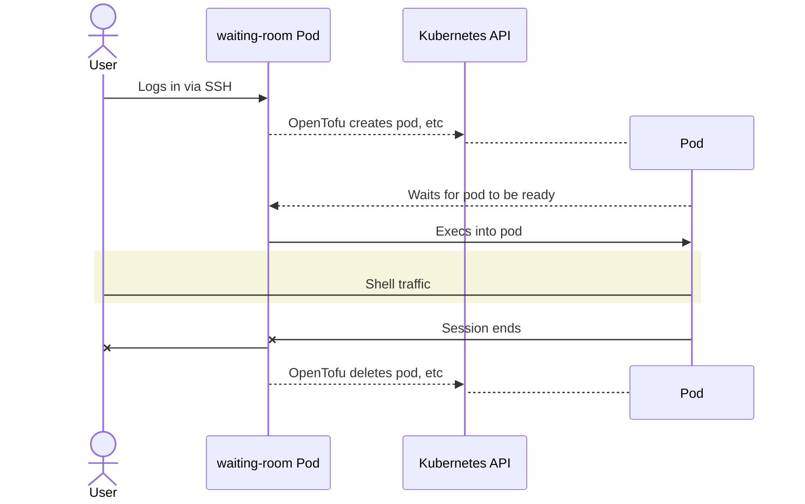

# K8S Waiting Room

**or: How I Learned To Stop Worrying And Reimplement XINETD**

A Kubernetes SSH server that spins up Kubernetes resources on-demand as users
log in. Originally written for the [DamCTF 2024 `copy-down` CTF
challenge](https://gitlab.com/osusec/damctf-2024-challenges/-/tree/main/misc/copy-down?ref_type=heads)
to solve a provisioning problem: how to give each connected user their own copy
of provisioned infrastructure? (in this case, a Gitlab project, runner, and K8S
pod.)

This uses OpenTofu to provision a new Kubernetes pod (and any other resources!)
whenever a new user connects to the Waiting Room, and cleans up after the user
disconnects.

## What this does, in more detail

1. [`waiting-room.deployment.yaml`](./waiting-room.deployment.yaml) listens for
SSH connections on port `13337`

2. Users log in to user `user` via SSH, which runs
[`waiting-room.sh`](./container/waiting-room.sh) as their shell on login

3. `waiting-room.sh` runs `tofu apply` on the files under `/provisioning` and
   waits for the created pod to become ready

4. The waiting user is then `kubectl exec`'d into the new pod, and they can
happily do whatever they want in there

5. When the connection ends or is dropped, `waiting-room.sh` runs `tofu delete`
   on the created resources to clean up after itself

## Deploying your own

<!-- TODO! flesh this out into proper instructions -->

1. add OpenTofu code to stand up whatever services are needed in `provisioning/`
2. update the example pod template and secret to pass any credentials or information needed by each instance
3. build the waiting-room image (contains the Tofu)
4. update `waiting-room.deployment.yaml` with that image and deploy it
5. update cluster ingress controller config to listen on 13337 for waiting room ssh
